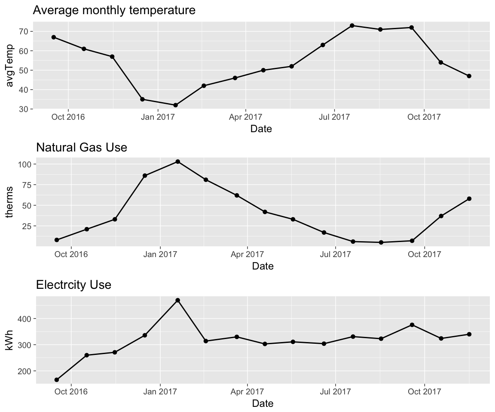
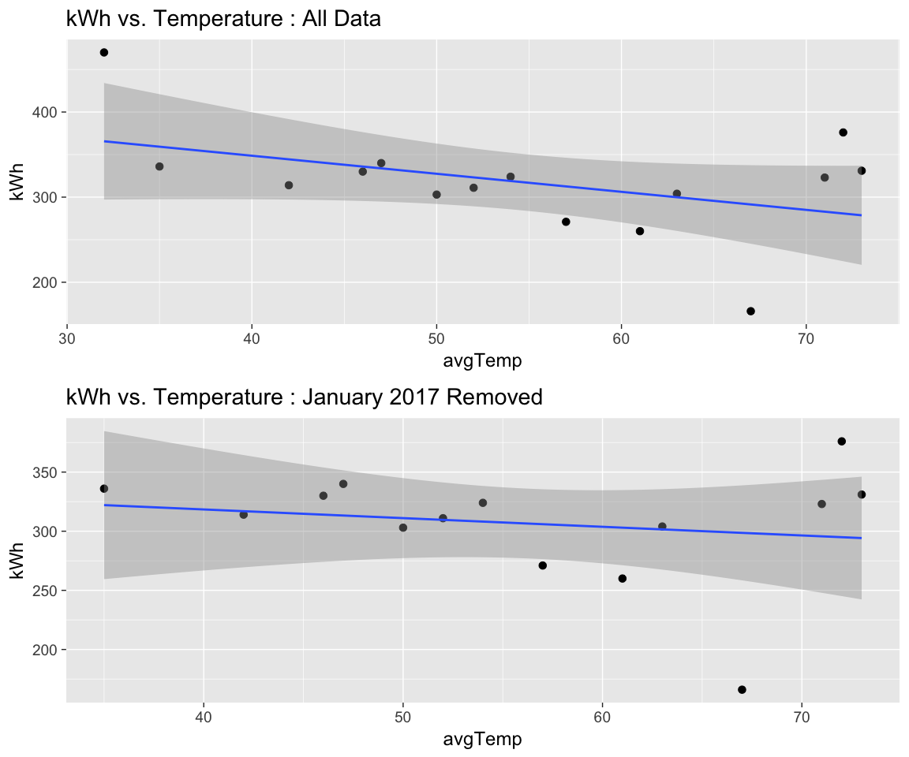

      
# Introduction

Winter is coming, but for us that means higher energy bills, not [whitewalkers](http://gameofthrones.wikia.com/wiki/White_Walkers) :) . We've had a few unseasonably warm days and not much snow yet, but it's definitely colder and we are now using our heat almost every night. I thought it would be fun to explore our energy usage data in R. 


# Data
[Xcel energy](https://www.xcelenergy.com/) lets you download your monthly usage data as a csv file. However it is not in a format that is easy to read in to R; it's probably possible to write code to read in the sections you want, but it really just wasn't worth it for an analysis I might do once a year. So I just copied the data I wanted (date, energy use, and temperature) into a new clean spreadsheet.

Then I read the csv files into R and clean them up:
* Rename columns
* Convert Date to a date variable
* remove degree signs from temperatures using gsub


```r
library(ggplot2)
theme_set(theme_gray(base_size = 18))
suppressPackageStartupMessages(library(dplyr))
suppressPackageStartupMessages(library(lubridate))
```

### Gas data

```r
# load gas data
gas <- read.csv('data/xcel_gas.csv',stringsAsFactors = FALSE)
gas <-gas %>% rename(Date=Last.Read.Date,therms=Gas.Usage..Therms.,avgTemp=Average.Temperature) %>% 
  select(Date,therms,avgTemp) %>% 
  mutate(Date=mdy(Date)) %>% 
  filter(!is.na(Date)) %>%
  mutate(Yr=as.factor(lubridate::year(Date))) %>%
  mutate(avgTemp=as.integer(gsub("[^0-9]", "", avgTemp) ))
head(gas)
```

```
##         Date therms avgTemp   Yr
## 1 2018-04-19     42      47 2018
## 2 2018-03-21     73      39 2018
## 3 2018-02-20     94      35 2018
## 4 2018-01-19    103      34 2018
## 5 2017-12-18     69      45 2017
## 6 2017-11-16     58      47 2017
```


### Electric Data

```r
ele <- read.csv('data/xcel_elec.csv',stringsAsFactors = FALSE)

ele <- ele %>% rename(Date=Last.Read.Date,kWh=Electric.Usage..kWh.,avgTemp=Average.Temperature) %>% 
  select(Date,kWh,avgTemp) %>% 
  mutate(Date=mdy(Date)) %>% 
  filter(!is.na(Date)) %>%
  mutate(Yr=as.factor(lubridate::year(Date))) %>%
  mutate(avgTemp=as.integer(gsub("[^0-9]", "", avgTemp) ))

head(ele)
```

```
##         Date kWh avgTemp   Yr
## 1 2018-04-19 418      47 2018
## 2 2018-03-21 392      39 2018
## 3 2018-02-20 468      35 2018
## 4 2018-01-19 481      34 2018
## 5 2017-12-18 494      45 2017
## 6 2017-11-16 340      47 2017
```


# Analysis


### Timeseries 
First i'll look at timeseries of temperature, gas use, and electricity use

```r
p1 <- gas %>% ggplot(aes(Date,avgTemp))+
    geom_line(size=1)+
  geom_point(size=3)+
  ggtitle("Average monthly temperature")

p2 <-gas %>% ggplot(aes(Date,therms))+
  geom_line(size=1)+
  geom_point(size=3)+
  ggtitle("Natural Gas Use")

p3 <-ele %>% ggplot(aes(Date,kWh))+
  geom_line(size=1)+
  geom_point(size=3)+
  ggtitle("Electrcity Use")

gridExtra::grid.arrange(p1,p2,p3)
```

<!-- -->


### Energy use vs temperature
* A scatter plot is good for showing the relationship between energy use and temperature.
* There is a very strong correlation between gas use and temperature
* This makes sense because we have gas heat, and the only other gas appliance we have is the water heater.
* You can see there is sort of a 'break' in the relationship for temperatures above 70 deg. We never use our heat if it's hotter than 70 deg, so gas usage shouldn't depend on temperature above 70 deg.


```r
p1 <- gas %>% ggplot(aes(avgTemp,therms))+
  geom_point(size=5,aes(col=Yr))+
  geom_smooth(method='lm')+
  ggtitle("Gas Usage vs Temperature ; All Data")+
   xlab("Monthly Avg. Temperature")

gas2 <- gas %>% filter(avgTemp<70)
p2 <-  gas2 %>% 
  ggplot(aes(avgTemp,therms))+
  geom_point(size=5,aes(col=Yr))+
  geom_smooth(method='lm')+
  ggtitle("Gas Usage vs Temperature ; Only Temp <70")+
   xlab("Monthly Avg. Temperature")


gridExtra::grid.arrange(p1,p2)
```

<!-- -->

### Linear regression vs Temperature

We can fit a linear regression to quantify the dependence of gas usage on temperature. I fit 2 models; 1 with all the data, and another excluding data where temperature>70.

#### Model w/ All Data

```r
model1 <- lm(therms~avgTemp,data=gas)
broom::tidy(model1)
```

```
##          term   estimate  std.error statistic      p.value
## 1 (Intercept) 170.107403 10.2314386  16.62595 3.854125e-10
## 2     avgTemp  -2.367027  0.1936606 -12.22256 1.675853e-08
```

#### Model w/ Only Temperature<70

```r
model2 <- lm(therms~avgTemp,data=gas %>% filter(avgTemp<70))
broom::tidy(model2)
```

```
##          term   estimate  std.error statistic      p.value
## 1 (Intercept) 199.533665 13.8055013  14.45320 4.992949e-08
## 2     avgTemp  -3.038635  0.2948149 -10.30693 1.204038e-06
```

* Both models return estimates that are statistically significant (very small p-values). I'll use the model excluding temperatures <70, since we definitely don't use any gas heat in that range.
* The model slope is -2.71, which means that for every degree colder it is (below 70 degress), we use 2.71 more therms of natural gas. 
* We are planning to add insulation to our attic, so it will be interesting to see if the slope changes after that (hopefully it does!)


### Electricity use vs Temperature

* From the 1st timeseries plot, the electricity usage looks fairly constant, except for a spike in January 2017. We have gas heat, so *why the spike*?
* Well, when we bought the house there was no heat vent in the back room and we used an electric heater there; the spike in January is likely due to that. We had a vent installed in February and didn't need to use the electric heater anymore. 
* The first value (Sept. 2016) is also lower than the rest; probably because we were moving in during this period and our first bill didn't cover a full month.


```r
p1 <- ele %>% ggplot(aes(avgTemp,kWh))+
  geom_point(size=5, aes(col=Yr) )+
  geom_smooth(method = 'lm')+
  ggtitle("kWh vs. Temperature : All Data")+
   xlab("Monthly Avg. Temperature")


p2 <- ele %>% filter(kWh<450 & kWh>200) %>%
  ggplot(aes(avgTemp,kWh))+
  geom_point(size=5, aes(col=Yr) )+
  geom_smooth(method = 'lm') +
  ggtitle("kWh vs. Temperature : Sept 2016 and January 2017 Removed")+
 xlab("Monthly Avg. Temperature")
   
gridExtra::grid.arrange(p1,p2)
```

<!-- -->

### Linear Regression vs. temperature
A linear regression of electricty use vs temperature shows no significant relationship (the slope pvalue is 0.5).

```r
model_ele <- lm(kWh~avgTemp,data = ele %>% filter(kWh<450 & kWh>200) )
broom::tidy(model_ele)
```

```
##          term    estimate  std.error  statistic      p.value
## 1 (Intercept) 370.5800356 51.6799885  7.1706679 7.253763e-06
## 2     avgTemp  -0.7734246  0.9367298 -0.8256646 4.238881e-01
```


* The scatter plots above show there isn't really much of a relationship between electricity use and temperature. The 3 higher points above 70 degrees might be due to our window AC unit, but other than that there isn't much seasonality to our electricity use.

* We also just got an electric car that we charge at home every few nights, so it will be interesting to see how that changes our electricity usage.


## Try it out with your energy data and let me know what you find!
